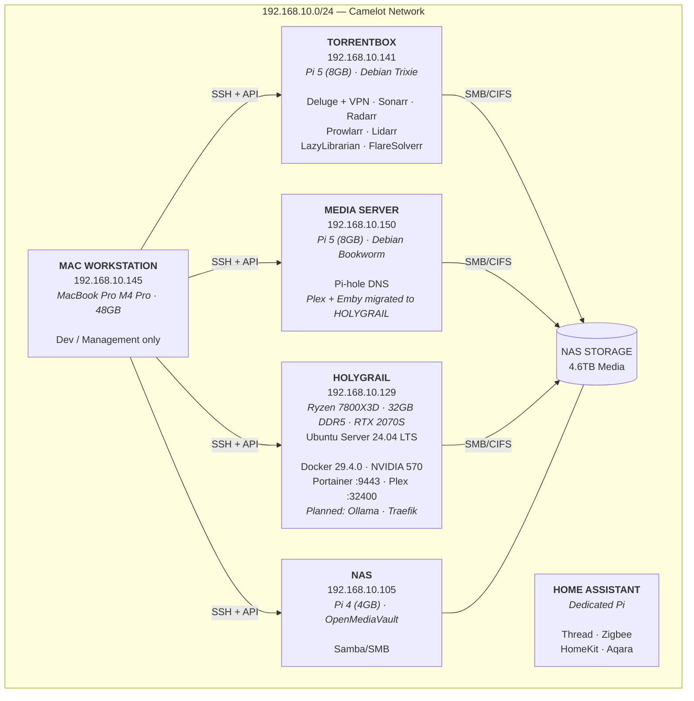
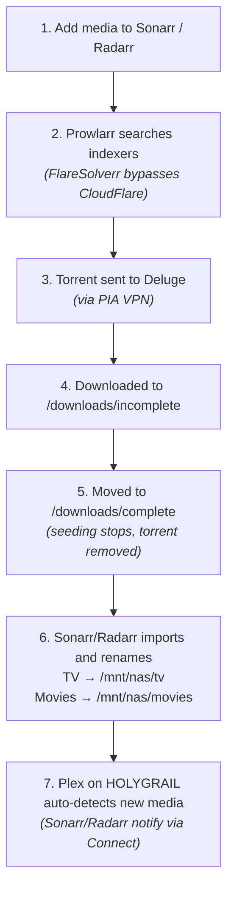

# Camelot Infrastructure

## Network Overview



---

## HOLYGRAIL (192.168.10.129)

### System Info

| Property | Value |
|----------|-------|
| Hostname | holygrail |
| Hardware | Custom desktop (basement server, headless) |
| CPU | AMD Ryzen 7 7800X3D (8c/16t, Zen 4 3D V-Cache) |
| RAM | 32 GB DDR5 |
| GPU | NVIDIA RTX 2070 Super (8 GB VRAM) |
| OS | Ubuntu Server 24.04 LTS |
| NIC | Realtek 2.5GbE (enp7s0, wired) |
| IP | 192.168.10.129/24 (static via Netplan) |
| DNS | Pi-hole (192.168.10.150) + 8.8.8.8 fallback |
| SSH | `ssh holygrail` or `ssh john@192.168.10.129` (key-only) |

### Storage

| Disk | Size | Used | Format | Description |
|------|------|------|--------|-------------|
| NVMe SSD | 98 GB (LVM) | ~12 GB | ext4 | OS + Docker volumes |
| NVMe Boot | 2.0 GB | 104 MB | ext4 | /boot |
| EFI | 1.1 GB | 6.2 MB | FAT32 | /boot/efi |

### Deployed Services

| Service | Port | Status | Description |
|---------|------|--------|-------------|
| Docker Engine | — | Running | Container runtime v29.4.0 + Compose v5.1.1 |
| NVIDIA Driver | — | Loaded | Driver 570.211.01, CUDA 12.8 |
| NVIDIA Container Toolkit | — | Configured | GPU passthrough into containers |
| Portainer CE | 9443 (HTTPS) | Running | Container management UI (UFW: LAN only) |
| UFW Firewall | — | Active | SSH (22) + Portainer (9443) + Plex (32400) from LAN |
| Plex | 32400 | Running | Media server with NVENC hardware transcoding (linuxserver/plex) |
| Traefik | 80 | Running | Reverse proxy — hostname routing for all services |
| Grafana | 3000 | Running | Monitoring dashboards (network latency, speedtest, packet loss) |
| InfluxDB | 8086 | Running | Time-series database (`network_metrics`) |
| Smokeping | 8081 | Running | Continuous latency and packet loss monitoring |
| Ollama | 11434 | Running | Local LLM inference (GPU-accelerated, Llama 3.1 8B) |

### Service Hostnames (via Traefik)

| Hostname | Service | Fallback |
|----------|---------|----------|
| `grafana.holygrail` | Grafana dashboards | http://192.168.10.129:3000 |
| `smokeping.holygrail` | Smokeping UI | http://192.168.10.129:8081 |
| `plex.holygrail` | Plex Web | http://192.168.10.129:32400/web |
| `portainer.holygrail` | Portainer CE | https://192.168.10.129:9443 |
| `traefik.holygrail` | Traefik dashboard | http://192.168.10.129:8080 |
| `ollama.holygrail` | Ollama LLM API | http://192.168.10.129:11434 |

Mac setup: `sudo bash scripts/setup-holygrail-dns.sh` (adds `/etc/hosts` entries)

### NAS Media Mounts

```
/mnt/nas/movies      → //192.168.10.105/Movies   (cifs, systemd automount)
/mnt/nas/tv          → //192.168.10.105/TV        (cifs, systemd automount)
/mnt/nas/music       → //192.168.10.105/Music     (cifs, systemd automount)
```

Credentials: `/etc/samba/nas-creds` (mode 600)

### Plex Docker Compose

Location: `~/docker/plex/docker-compose.yml` (source: `infrastructure/holygrail/plex/docker-compose.yml`)

```yaml
services:
  plex:
    image: lscr.io/linuxserver/plex:latest
    container_name: plex
    runtime: nvidia
    network_mode: host
    restart: unless-stopped
    environment:
      - PUID=1000
      - PGID=1000
      - TZ=America/Denver
      - VERSION=docker
      - NVIDIA_VISIBLE_DEVICES=all
      - NVIDIA_DRIVER_CAPABILITIES=all
    volumes:
      - plex_config:/config
      - /tmp/plex-transcode:/transcode
      - /mnt/nas/movies:/movies:ro
      - /mnt/nas/tv:/tv:ro
      - /mnt/nas/music:/music:ro
```

### Planned Services (future phases)

| Service | Port | Phase | Description |
|---------|------|-------|-------------|
| Network Advisor | TBD | Phase 4 | AI-powered network dashboard |

---

## Torrentbox (192.168.10.141)

### System Info

| Property | Value |
|----------|-------|
| Hostname | torrentbox |
| Hardware | Raspberry Pi 5 (8GB RAM) + Pironman5 case |
| OS | Raspberry Pi OS Lite 64-bit (Debian Trixie) |
| SSH | `ssh john@192.168.10.141` |

### Storage

| Disk | Size | Format | Mount Point | Description |
|------|------|--------|-------------|-------------|
| SD Card | 917GB | ext4 | / | OS drive |
| Samsung T7 USB | 932GB | exFAT | /mnt/media | Travel media (portable) |

**Travel Media Structure:**
```
/mnt/media/
├── Movies/
└── TV/
```

### Docker Services

| Service | Port | Description |
|---------|------|-------------|
| Deluge Web UI | 8112 | Torrent client |
| Deluge Daemon | 58846 | RPC interface |
| Sonarr | 8989 | TV show management |
| Radarr | 7878 | Movie management |
| Prowlarr | 9696 | Indexer management |
| FlareSolverr | 8191 | CloudFlare bypass |
| Lidarr | 8686 | Music management |
| LazyLibrarian | 5299 | Book management |

### Docker Compose

Location: `/home/john/docker/docker-compose.yml`

```yaml
services:
  deluge:
    image: lscr.io/linuxserver/deluge:latest
    container_name: deluge
    environment:
      - PUID=1000
      - PGID=1000
      - TZ=America/Denver
      - DELUGE_LOGLEVEL=error
    volumes:
      - /home/john/docker/deluge:/config
      - /mnt/nas/torrents:/downloads
    ports:
      - 8112:8112
      - 58846:58846
      - 6881:6881
      - 6881:6881/udp
    restart: unless-stopped

  sonarr:
    image: lscr.io/linuxserver/sonarr:latest
    container_name: sonarr
    environment:
      - PUID=1000
      - PGID=1000
      - TZ=America/Denver
    volumes:
      - /home/john/docker/sonarr:/config
      - /mnt/nas/tv:/tv
      - /mnt/nas/torrents:/downloads
      - /mnt/media/TV:/travel-tv
    ports:
      - 8989:8989
    restart: unless-stopped

  radarr:
    image: lscr.io/linuxserver/radarr:latest
    container_name: radarr
    environment:
      - PUID=1000
      - PGID=1000
      - TZ=America/Denver
    volumes:
      - /home/john/docker/radarr:/config
      - /mnt/nas/movies:/movies
      - /mnt/nas/torrents:/downloads
      - /mnt/media/Movies:/travel-movies
    ports:
      - 7878:7878
    restart: unless-stopped

  prowlarr:
    image: lscr.io/linuxserver/prowlarr:latest
    container_name: prowlarr
    environment:
      - PUID=1000
      - PGID=1000
      - TZ=America/Denver
    volumes:
      - /home/john/docker/prowlarr:/config
    ports:
      - 9696:9696
    restart: unless-stopped

  flaresolverr:
    image: ghcr.io/flaresolverr/flaresolverr:latest
    container_name: flaresolverr
    environment:
      - LOG_LEVEL=info
      - TZ=America/Denver
    ports:
      - 8191:8191
    restart: unless-stopped

  lidarr:
    image: lscr.io/linuxserver/lidarr:latest
    container_name: lidarr
    environment:
      - PUID=1000
      - PGID=1000
      - TZ=America/Denver
    volumes:
      - /home/john/docker/lidarr:/config
      - /mnt/nas/music:/music
      - /mnt/nas/torrents:/downloads
    ports:
      - 8686:8686
    restart: unless-stopped

  lazylibrarian:
    image: lscr.io/linuxserver/lazylibrarian:latest
    container_name: lazylibrarian
    environment:
      - PUID=1000
      - PGID=1000
      - TZ=America/Denver
      - DOCKER_MODS=linuxserver/mods:universal-calibre
    volumes:
      - /home/john/docker/lazylibrarian:/config
      - /mnt/nas/books:/books
      - /mnt/nas/torrents:/downloads
    ports:
      - 5299:5299
    restart: unless-stopped
```

### NAS Mounts

`/etc/fstab` entries:
```
//192.168.10.105/Movies    /mnt/nas/movies    cifs    credentials=/etc/nas-credentials,uid=1000,gid=1000,iocharset=utf8,vers=3.0,nofail,_netdev    0    0
//192.168.10.105/TV        /mnt/nas/tv        cifs    credentials=/etc/nas-credentials,uid=1000,gid=1000,iocharset=utf8,vers=3.0,nofail,_netdev    0    0
//192.168.10.105/Torrents  /mnt/nas/torrents  cifs    credentials=/etc/nas-credentials,uid=1000,gid=1000,iocharset=utf8,vers=3.0,nofail,_netdev    0    0
//192.168.10.105/Music     /mnt/nas/music     cifs    credentials=/etc/nas-credentials,uid=1000,gid=1000,iocharset=utf8,vers=3.0,nofail,_netdev    0    0
//192.168.10.105/Books     /mnt/nas/books     cifs    credentials=/etc/nas-credentials,uid=1000,gid=1000,iocharset=utf8,vers=3.0,nofail,_netdev    0    0
UUID=EFEE-EB42 /mnt/media exfat defaults,uid=1000,gid=1000,nofail 0 0
```

NAS credentials: `/etc/nas-credentials` (chmod 600)

### Samba Share

`/etc/samba/smb.conf`:
```ini
[Media]
   comment = Travel Media (Samsung T7)
   path = /mnt/media
   browseable = yes
   read only = no
   guest ok = no
   valid users = john
   create mask = 0755
   directory mask = 0755
```

Network access: `\\192.168.10.141\Media`

### VPN Configuration

PIA VPN with kill-switch enabled.

| Setting | Value |
|---------|-------|
| Config | /etc/openvpn/pia.conf |
| Server | us-denver.privacy.network:1197 |
| Protocol | UDP |
| Cipher | AES-256-CBC |

**Kill-switch script** (`/etc/openvpn/vpn-up.sh`):
- Allows loopback and local network (192.168.10.0/24)
- Allows Docker network (172.16.0.0/12)
- Allows VPN tunnel traffic
- Blocks all other outbound traffic

**Service management:**
```bash
sudo systemctl status openvpn@pia
sudo systemctl restart openvpn@pia
```

### Deluge Settings

Storage + privacy tuning applied 2026-04-14 (feature 014 US-3). Delete-after-download policy preserved — no seeding, torrents removed from Deluge immediately after file moves to `/downloads/complete`.

**Paths + auth:**

| Setting | Value |
|---------|-------|
| Download location | /downloads/incomplete |
| Move completed | /downloads/complete |
| Web password | subterra |
| Daemon password | subterra |

**Connection + queue limits** (applied via `/home/john/docker/deluge/core.conf`):

| Key | Value |
|-----|-------|
| `max_connections_global` | 200 |
| `max_connections_per_torrent` | 50 |
| `max_active_downloading` | 3 |
| `max_active_seeding` | 5 |
| `max_active_limit` | 8 |
| `max_upload_slots_global` | 40 |
| `max_upload_slots_per_torrent` | 4 |

**Encryption + peer hygiene** (forced encryption both ways, all peer-discovery protocols off for private-tracker compatibility + privacy):

| Key | Value |
|-----|-------|
| `enc_in_policy` / `enc_out_policy` | 2 / 2 (Forced) |
| `enc_allow_legacy` | false |
| `dht` / `lsd` / `utpex` | false / false / false |
| `upnp` / `natpmp` | false / false |
| `random_port` | false |
| `listen_ports` | [6881, 6891] (unchanged from prior) |
| `outgoing_ports` | [0, 0] (unconstrained) |

**Seeding policy** (delete after download complete — operator preference):

| Key | Value |
|-----|-------|
| `stop_seed_at_ratio` | true |
| `stop_seed_ratio` | 0.0 (stop immediately post-complete) |
| `remove_seed_at_ratio` | true (torrent removed from Deluge; file survives in `/downloads/complete` via `move_completed`) |
| `share_ratio_limit` | 2.0 (legacy field; ineffective because stop/remove fires first) |

**VPN routing + kill-switch** (2026-04-14 incident context):

Torrentbox runs OpenVPN at the **host level** (`openvpn@pia.service`, config `/etc/openvpn/pia.conf`, gateway `us-denver.privacy.network:1197/udp`, auth in `/etc/openvpn/pia-credentials.txt`). Deluge runs on the `docker_default` bridge network and egresses via the host's default route, which points at PIA's `tun0` when the tunnel is up. Verify Deluge is routing through VPN with:

```bash
docker exec deluge curl -s ifconfig.me   # must be a PIA exit (e.g. 181.41.x.x), NOT the home WAN IP
```

**Known architectural gaps** (deferred to a future `015-*` feature):

1. **Inverted kill-switch semantics**: `/etc/openvpn/vpn-up.sh` applies restrictive iptables rules *while the tunnel is up*, and `/etc/openvpn/vpn-down.sh` resets them to ACCEPT *when the tunnel goes down*. If `openvpn@pia` dies, Deluge silently falls back to eth0 (home WAN). This is how feature 014 surfaced a 7-week silent outage (2026-02-23 → 2026-04-14, caused by a mangled shebang — literal `#\!/bin/bash` — in `vpn-up.sh`; fixed as part of 014).
2. **No `listen_interface` binding**: proper tunnel-or-nothing binding requires the Deluge container to see `tun0` directly, which it can't in the host-OpenVPN + docker-bridge topology.
3. **Inbound peer port on home WAN**: Compose maps `6881:6881` on the host interface; inbound peer connections would see the home IP, not the PIA exit.
4. **No PIA port forwarding configured** — Deluge is effectively a leech-only client.

All four collapse once Deluge is migrated behind a VPN sidecar container (`qmcgaw/gluetun` or similar) using `network_mode: service:gluetun`.

### Quality Profiles (Sonarr + Radarr)

Both apps run the `HD Bluray + WEB` profile (Sonarr id=8, Radarr id=7) as the intended default for new series/movies. Storage-conscious: hard cap ~10 GB per file, preferred 3–6 GB band. See [specs/014-indexers-quality/](../specs/014-indexers-quality/) for rationale.

| Setting | Value |
|---------|-------|
| Profile name | HD Bluray + WEB |
| Allowed tiers | Bluray-1080p, WEBDL-1080p, WEBRip-1080p (others disabled incl. Remux, HDTV, SD) |
| Priority order (top = highest) | Bluray-1080p > WEBDL-1080p ≈ WEBRip-1080p (WEB tier grouped) |
| Upgrade cutoff | Bluray-1080p (quality.id=7) |
| `cutoffFormatScore` / `minFormatScore` | 10000 / 0 (unreachable CF cutoff — upgrades continue to Bluray, then stop) |
| `upgradeAllowed` | true |

Size caps (MB/min):

| Media | Tier | min | preferred | max | Implied ceiling at typical runtime |
|-------|------|-----|-----------|-----|-----------------------------------|
| TV (Sonarr) | WEBDL-1080p, WEBRip-1080p | 15 | 45 | 80 | 60-min ep ≤ 4.8 GB |
| TV (Sonarr) | Bluray-1080p | 50 | 55 | 80 | 60-min ep ≤ 4.8 GB |
| Movies (Radarr) | WEBDL-1080p, WEBRip-1080p | 15 | 45 | 55 | 180-min epic ≤ 9.9 GB |
| Movies (Radarr) | Bluray-1080p | 50 | 50 | 55 | 180-min epic ≤ 9.9 GB |

Effect: WEB-DL at 40–55 MB/min is the typical grab; high-bitrate Bluray encodes (80+ MB/min) are rejected in favor of WEB-DL. Intended trade-off — storage balance over last-increment quality.

TRaSH Custom Formats are NOT imported. In-tier ranking is by profile tier order only. If fine-grained ranking (release-group preferences, HDR flavor, repack/proper) is wanted later, install Recyclarr and sync the `HD Bluray + WEB` template against this profile. Reference: <https://trash-guides.info/Sonarr/sonarr-setup-quality-profiles/>.

Note: Sonarr 4.x and Radarr 6.x no longer support a server-side "default quality profile" per root folder. The profile is selectable in the Add Series / Add Movie dropdown; the UI remembers the last-used choice per browser.

---

## NAS Server (192.168.10.105)

### System Info

| Property | Value |
|----------|-------|
| Hostname | nas01 |
| Hardware | Raspberry Pi 4 (4GB RAM) |
| OS | OpenMediaVault (Debian-based) |
| SSH | `ssh pi@192.168.10.105` |

### Storage

| Disk | Size | Used | Mount Point |
|------|------|------|-------------|
| Media Disk | 4.6TB | 2.8TB (61%) | /mnt/media-disk |
| Archive Disk | 916GB | 44GB (5%) | /srv/dev-disk-... |
| SD Card | 117GB | 3.7GB (4%) | / |

### SMB Shares

| Share | Path | Size |
|-------|------|------|
| Movies | /mnt/media-disk/MediaStorage/Media/Movies/ | 1.2TB |
| TV | /mnt/media-disk/MediaStorage/Media/TV/ | 980GB |
| Torrents | /mnt/media-disk/MediaStorage/Media/torrent-downloads/ | - |
| Music | /mnt/media-disk/MediaStorage/Media/Music/ | 5.3GB |
| Books | /mnt/media-disk/MediaStorage/Media/Books/ | 2.9GB |

### Services

| Service | Port |
|---------|------|
| OpenMediaVault | 80 |
| Pi-hole | 80/admin, 53 |
| Samba | 139, 445 |

---

## Media Server (192.168.10.150) — Pi-hole DNS Only

> **Migration note (2026-04-07)**: Plex and Emby have been migrated to HOLYGRAIL (F2.1).
> This Pi now serves only as a Pi-hole DNS server.

### System Info

| Property | Value |
|----------|-------|
| Hostname | herring |
| Hardware | Raspberry Pi 5 (8GB RAM) |
| OS | Debian GNU/Linux 12 (Bookworm) |
| SSH | `ssh pi@192.168.10.150` |
| Role | Pi-hole DNS (formerly media server) |

### Storage

| Disk | Size | Format | Mount Point | Description |
|------|------|--------|-------------|-------------|
| NVMe SSD | 465GB | ext4 | / | OS drive |
| USB Drive 1 | 932GB | ntfs | /mnt/usb2 | Local media (unused after migration) |
| USB Drive 2 | 932GB | ext4 | /mnt/media | Local media (unused after migration) |

### Services

| Service | Port | Status |
| ------- | ---- | ------ |
| Pi-hole | 53 (DNS), 80 (admin) | Running |
| ~~Plex~~ | ~~32400~~ | Stopped — migrated to HOLYGRAIL |
| ~~Emby~~ | ~~8096~~ | Stopped — retired (see below) |

### NAS & Torrentbox Mounts

```
/mnt/nas/Movies      → //192.168.10.105/Movies
/mnt/nas/TV          → //192.168.10.105/TV
/mnt/torrentbox      → //192.168.10.141/Media
```

### Emby Docker (RETIRED)

> **Retired 2026-04-07**: Emby has been decommissioned. Plex on HOLYGRAIL with NVENC
> hardware transcoding replaces both Plex and Emby on this Pi. Emby added no unique
> value over Plex and would compete for GPU/RAM with Plex and Ollama on HOLYGRAIL.

<details>
<summary>Previous Emby configuration (archived)</summary>

```bash
docker run -d \
  --name emby \
  --restart unless-stopped \
  -e PUID=1000 -e PGID=1000 -e TZ=America/Denver \
  -p 8096:8096 -p 8920:8920 \
  -v /home/pi/docker/emby:/config \
  -v /mnt/nas/Movies:/data/nas-movies \
  -v /mnt/nas/TV:/data/nas-tv \
  -v /mnt/usb2/Movies:/data/local-movies \
  -v /mnt/usb2/TV:/data/local-tv \
  -v /mnt/media/Movies:/data/media-movies \
  -v /mnt/media/TV:/data/media-tv \
  -v /mnt/torrentbox/Movies:/data/torrentbox-movies \
  -v /mnt/torrentbox/TV:/data/torrentbox-tv \
  lscr.io/linuxserver/emby:latest
```

</details>

---

## Mac Workstation (192.168.10.145)

### System Info

| Property | Value |
|----------|-------|
| Hostname | Johns-MacBook-Pro.local |
| Hardware | MacBook Pro (Apple M4 Pro, 48GB RAM) |
| Model | Mac16,7 (MX2Y3LL/A) |
| OS | macOS 26.3.1 |
| SSH | N/A (management workstation — not a server) |

### Role

Development and management workstation. **No services are hosted on this machine.** Used for:
- Remote management of all Raspberry Pi devices via SSH
- Monitoring and troubleshooting torrent services (Deluge, Sonarr, Radarr, etc.)
- Infrastructure development and code management (this repo)
- Network benchmarking and monitoring from macOS
- Accessing web UIs for all services

### SSH Access to Devices

```bash
ssh john@192.168.10.141   # Torrentbox
ssh pi@192.168.10.105     # NAS
ssh pi@192.168.10.150     # Media Server
```

### NAS SMB Access (macOS)

Connect via Finder: `smb://192.168.10.105/<ShareName>`

| Share | Finder URL |
|-------|-----------|
| Movies | smb://192.168.10.105/Movies |
| TV | smb://192.168.10.105/TV |
| Torrents | smb://192.168.10.105/Torrents |
| Music | smb://192.168.10.105/Music |
| Books | smb://192.168.10.105/Books |

Or mount from terminal:
```bash
mount_smbfs //pi@192.168.10.105/Movies /Volumes/Movies
```

---

## Application Configuration

### Root Folders

| Application | Container Path | Host Path |
|-------------|----------------|-----------|
| Sonarr | /tv | /mnt/nas/tv |
| Sonarr | /travel-tv | /mnt/media/TV |
| Radarr | /movies | /mnt/nas/movies |
| Radarr | /travel-movies | /mnt/media/Movies |
| Lidarr | /music | /mnt/nas/music |
| LazyLibrarian | /books | /mnt/nas/books |

### Download Client (Deluge)

For all *arr apps:

| Setting | Value |
|---------|-------|
| Host | deluge |
| Port | 8112 |
| Password | subterra |

Categories: `tv-sonarr`, `radarr`, `lidarr`

### Prowlarr Apps

| App | Server | API Key |
|-----|--------|---------|
| Sonarr | http://sonarr:8989 | ebb7706d9d7f4401939338bab7ebc103 |
| Radarr | http://radarr:7878 | e6e70d60d9aa4daca794a64ea858c63a |

FlareSolverr: `http://flaresolverr:8191`

### API Keys

| Service | API Key |
|---------|---------|
| Sonarr | ebb7706d9d7f4401939338bab7ebc103 |
| Radarr | e6e70d60d9aa4daca794a64ea858c63a |
| Prowlarr | 272a8c0521614ce8bfdf9bf413a746f5 |
| Lidarr | 2d4510f26b1b460fad199ab39a31c33d |

### LazyLibrarian Kindle

| Setting | Value |
|---------|-------|
| Email From | doucette.j@gmail.com |
| Kindle Address | doucette.j_Kindle@kindle.com |
| SMTP | smtp.gmail.com:587 (TLS) |

---

## Data Flow



---

## Web Interfaces

| Service | URL |
|---------|-----|
| Deluge | http://192.168.10.141:8112 |
| Sonarr | http://192.168.10.141:8989 |
| Radarr | http://192.168.10.141:7878 |
| Prowlarr | http://192.168.10.141:9696 |
| Lidarr | http://192.168.10.141:8686 |
| LazyLibrarian | http://192.168.10.141:5299 |
| Plex | http://192.168.10.129:32400/web |
| OpenMediaVault | http://192.168.10.105 |
| Pi-hole | http://192.168.10.105/admin |

---

## Storage Summary

| Location | Capacity | Used | Available |
|----------|----------|------|-----------|
| NAS Media Disk | 4.6TB | 2.8TB | 1.8TB |
| NAS Archive Disk | 916GB | 44GB | 872GB |
| Media Server NVMe | 465GB | - | ~465GB |
| Media Server USB 1 | 932GB | - | ~932GB |
| Media Server USB 2 | 932GB | - | ~932GB |
| Torrentbox SD | 931GB | 4.3GB | 876GB |
| Torrentbox USB (Travel) | 932GB | - | ~932GB |
| **Total** | **~9.7TB** | **~2.9TB** | **~6.8TB** |

---

## Credentials

| Service | User | Password/Notes |
|---------|------|----------------|
| Torrentbox SSH | john | Key auth |
| NAS SSH | pi | Key auth |
| Media Server SSH | pi | Key auth |
| NAS SMB | pi | subterra |
| Deluge | - | subterra |
| PIA VPN | p5674691 | /etc/openvpn/pia-credentials.txt |

---

## Common Commands

### Docker Management
```bash
cd ~/docker
docker compose ps              # Status
docker compose restart         # Restart all
docker compose logs -f sonarr  # View logs
docker compose pull && docker compose up -d  # Update
```

### Mount NAS
```bash
sudo mount -a
```

### Check VPN
```bash
curl ifconfig.me                           # From host
docker exec deluge curl -s ifconfig.me     # From container
```

### Reset Indexers (after VPN reconnect)
```bash
for app in prowlarr sonarr radarr lidarr; do
  docker stop $app
  sqlite3 /home/john/docker/$app/$app.db "DELETE FROM IndexerStatus;"
  docker start $app
done
```

### Fix NAS Permissions
```bash
ssh pi@192.168.10.105 "sudo chmod -R 777 /mnt/media-disk/MediaStorage/Media/TV/"
ssh pi@192.168.10.105 "sudo chmod -R 777 /mnt/media-disk/MediaStorage/Media/Movies/"
```

---

*Updated: April 2026*
