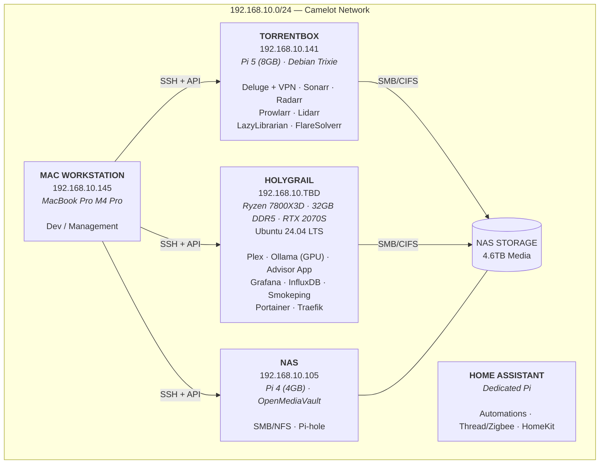
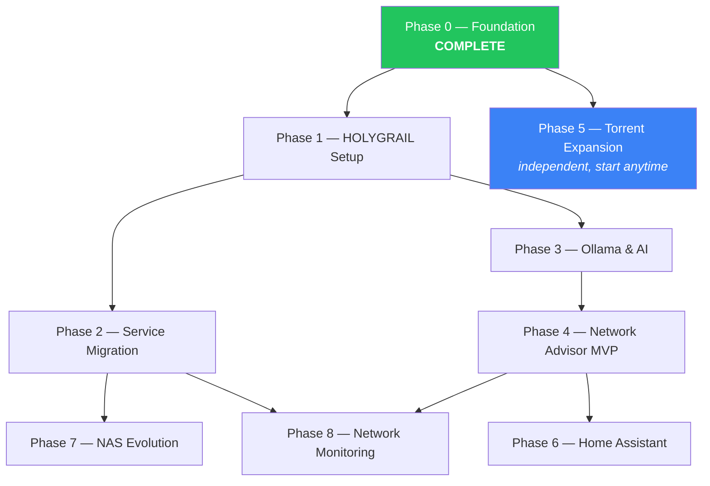

# Camelot — Master Project Plan

## Vision

A unified home infrastructure platform managed from a MacBook Pro. Raspberry Pis handle dedicated edge workloads (torrents, IoT), HOLYGRAIL serves as the central server (media, AI, monitoring, advisor), and the Camelot project ties it all together with documentation, tooling, and an AI-powered network advisor.

---

## Network Topology (Target State)



---

## Phases

### Phase 0 — Foundation (current)
**Status: Complete**

What was done:
- [x] Documented existing Pi infrastructure (INFRASTRUCTURE.md)
- [x] Monitoring stack built (Smokeping, Grafana, InfluxDB, Speedtest)
- [x] Added Mac workstation to infrastructure
- [x] Cross-platform benchmark script (Linux + macOS)
- [x] Mac-side management scripts (pi-status, pi-update, deluge-monitor)
- [x] Repo restructured as Camelot project

---

### Phase 1 — HOLYGRAIL Setup
**Status: Not started**
**Prerequisite: None**

Migrate HOLYGRAIL from Windows 11 to Ubuntu Server 24.04 LTS and establish it as the central Docker host.

| Step | Task | Details |
|------|------|---------|
| 1.1 | Back up HOLYGRAIL Windows | Document anything worth keeping; back up to NAS |
| 1.2 | Create Ubuntu 24.04 USB installer | From Mac: download ISO, flash with balenaEtcher or `dd` |
| 1.3 | Install Ubuntu Server 24.04 LTS | Headless-optimized: OpenSSH enabled, static IP, minimal install |
| 1.4 | Post-install configuration | Set hostname `holygrail`, configure static IP, set timezone |
| 1.5 | Install NVIDIA drivers + CUDA | Required for Ollama GPU acceleration |
| 1.6 | Install Docker + Docker Compose | Via official Docker apt repository |
| 1.7 | Install Portainer | Docker container for web-based container management |
| 1.8 | Install NVIDIA Container Toolkit | GPU passthrough for Docker containers |
| 1.9 | SSH key setup | Copy Mac's public key for passwordless access |
| 1.10 | Add HOLYGRAIL to Camelot scripts | Update ssh-config, pi-status.sh, pi-update.sh |
| 1.11 | Update INFRASTRUCTURE.md | Full HOLYGRAIL section with final IP, specs, services |

**Deliverables:**
- HOLYGRAIL running Ubuntu 24.04 with Docker + GPU support
- SSH accessible from Mac
- Portainer web UI accessible on LAN
- `docs/HOLYGRAIL-setup.md` — step-by-step guide for reproducibility

---

### Phase 2 — Service Migration
**Status: Not started**
**Prerequisite: Phase 1**

Migrate services from Pis to HOLYGRAIL where it makes sense.

| Step | Task | Details |
|------|------|---------|
| 2.1 | Deploy Plex on HOLYGRAIL | Docker with NVIDIA runtime for hardware transcoding |
| 2.2 | Migrate Plex libraries | Point at NAS SMB shares; transfer metadata from Pi |
| 2.3 | Retire Emby or keep as backup | Decide: Plex-only or keep Emby as fallback |
| 2.4 | Migrate monitoring stack | Move Grafana + InfluxDB + Smokeping to HOLYGRAIL Docker |
| 2.5 | Update Smokeping targets | Re-point from Torrentbox to HOLYGRAIL |
| 2.6 | Deploy Traefik reverse proxy | Clean URLs for all services (*.local or *.camelot) |
| 2.7 | Repurpose Media Server Pi | Freed up Pi 5 — reassign role or decommission |
| 2.8 | Update INFRASTRUCTURE.md | Reflect new service locations |

**Deliverables:**
- Plex running on HOLYGRAIL with NVENC transcoding
- Monitoring dashboards accessible at clean URLs
- Media Server Pi (150) available for reuse

---

### Phase 3 — Ollama & AI Foundation
**Status: Not started**
**Prerequisite: Phase 1**

Deploy local LLM infrastructure on HOLYGRAIL.

| Step | Task | Details |
|------|------|---------|
| 3.1 | Deploy Ollama container | Docker with GPU passthrough (NVIDIA runtime) |
| 3.2 | Pull Llama 3.1 8B model | Default advisor model; fits in 8GB VRAM |
| 3.3 | Test inference | Verify GPU acceleration, measure tokens/sec |
| 3.4 | Expose OpenAI-compatible API | Accessible on LAN for all devices |
| 3.5 | Test from Mac | curl requests to validate API endpoint |

**Deliverables:**
- Ollama running with GPU acceleration
- `http://holygrail:11434` serving LLM API on LAN
- Baseline performance metrics documented

---

### Phase 4 — Network Advisor MVP
**Status: Not started**
**Prerequisite: Phases 1, 3**

Build the core advisor application. See [network-advisor-spec.md](network-advisor-spec.md) for full requirements.

| Step | Task | Details |
|------|------|---------|
| 4.1 | Scaffold FastAPI backend | Project structure, Docker container, health endpoint |
| 4.2 | Scaffold React frontend | Vite + React + Tailwind, Docker container |
| 4.3 | Deploy PostgreSQL | Docker container, initial schema |
| 4.4 | Docker Compose for advisor | All three services orchestrated |
| 4.5 | Network discovery (nmap) | LAN scan, device inventory, persistence |
| 4.6 | Service registry | Docker socket integration, health checks |
| 4.7 | Dashboard UI | Device list, service status, health indicators |
| 4.8 | AI chat integration | Connect to Ollama, dynamic system prompt with network context |
| 4.9 | Recommendations engine | Rule-based alerts (CPU, memory, disk, connectivity) |

**Deliverables:**
- Network Advisor accessible at `http://holygrail:<port>`
- Device inventory populated from LAN scan
- Service health dashboard with green/yellow/red status
- AI chat answering questions grounded in live network state
- At least 5 recommendation rules firing

---

### Phase 5 — Torrent System Expansion
**Status: Not started**
**Prerequisite: Phase 0**

Enhance the torrent infrastructure on the Torrentbox Pi.

| Step | Task | Details |
|------|------|---------|
| 5.1 | Evaluate paid indexers | Research: IPTorrents, TorrentLeech, etc. |
| 5.2 | Add indexers to Prowlarr | Configure with API keys |
| 5.3 | Tune quality profiles | Sonarr/Radarr: prefer higher quality, reject cam/TS |
| 5.4 | Deluge optimization | Connection limits, encryption, queue management |
| 5.5 | Automated exe cleanup | Cron job using deluge-monitor.py --remove-exe |
| 5.6 | Add Readarr for books | Replace LazyLibrarian if better; or keep both |

**Deliverables:**
- Higher quality torrents via paid indexers
- Automated cleanup of bad downloads
- Optimized quality profiles

---

### Phase 6 — Home Assistant Integration
**Status: Not started**
**Prerequisite: Phase 4**

Connect the Network Advisor to Home Assistant for IoT visibility.

| Step | Task | Details |
|------|------|---------|
| 6.1 | Document HA setup | Which Pi, IP, integrations, Thread topology |
| 6.2 | HA REST API integration | Connect advisor backend to HA API |
| 6.3 | Thread network visibility | Surface border router status, device connectivity |
| 6.4 | HA notification integration | Advisor alerts pushed as HA notifications |
| 6.5 | Advisor dashboard: IoT panel | Thread health, Zigbee devices, automation status |

**Deliverables:**
- Thread network health visible in advisor
- HA alerts surfaced in advisor dashboard
- Bidirectional: advisor can push notifications to HA

---

### Phase 7 — NAS & Storage Evolution
**Status: Not started**
**Prerequisite: Phase 2**

Plan and execute storage infrastructure improvements.

| Step | Task | Details |
|------|------|---------|
| 7.1 | Assess current storage | Capacity, performance, redundancy gaps |
| 7.2 | Evaluate NAS options | TrueNAS on HOLYGRAIL second disk vs dedicated NAS box |
| 7.3 | Plan migration path | Zero-downtime approach for 2.8TB of media |
| 7.4 | Implement new NAS | Deploy chosen solution |
| 7.5 | Update all mount points | Torrentbox, HOLYGRAIL, Mac all point to new NAS |
| 7.6 | Repurpose NAS Pi | Pi 4 freed for other use or retired |

**Deliverables:**
- Improved storage performance and redundancy
- Growth path beyond 4.6TB

---

### Phase 8 — Network Monitoring & Optimization
**Status: Not started**
**Prerequisite: Phases 2, 4**

Comprehensive network visibility and optimization.

| Step | Task | Details |
|------|------|---------|
| 8.1 | Full device inventory | All devices on 192.168.10.0/24 catalogued |
| 8.2 | Centralized logging | Loki + Promtail on HOLYGRAIL, all Pis ship logs |
| 8.3 | Bandwidth monitoring | Per-device traffic analysis |
| 8.4 | WiFi optimization | Channel analysis, band steering recommendations |
| 8.5 | DNS optimization | Evaluate Pi-hole vs AdGuard, consolidate |
| 8.6 | VLAN planning | Separate IoT, media, management traffic |

**Deliverables:**
- Complete network inventory in advisor
- Centralized log search across all devices
- WiFi and DNS optimized
- VLAN plan documented (implementation optional)

---

## Phase Dependencies



---

## Repo Structure

```
camelot/
├── CLAUDE.md                        # Project context for Claude Code
├── .gitignore
├── docs/                            # Specs, plans, guides (spec-kit compatible)
│   ├── PROJECT-PLAN.md              # This file
│   ├── INFRASTRUCTURE.md            # Full network topology and device details
│   ├── network-advisor-spec.md      # Network Advisor application spec
│   └── HOLYGRAIL-setup.md          # Ubuntu migration guide (Phase 1 output)
├── infrastructure/                  # Device-specific configs
│   ├── torrentbox/                  # Pi torrent stack Docker Compose (future)
│   ├── holygrail/                   # HOLYGRAIL Docker Compose configs
│   │   └── docker-compose.yml       # Plex, Ollama, Traefik, monitoring
│   └── monitoring/                  # Monitoring stack (migrating to HOLYGRAIL)
│       ├── docker-compose.yml
│       ├── grafana/
│       ├── scripts/
│       └── smokeping/
├── advisor/                         # Network Advisor app (Phase 4)
│   ├── backend/                     # FastAPI
│   ├── frontend/                    # React + Tailwind
│   └── docker-compose.yml
└── scripts/                         # Mac-side management tools
    ├── ssh-config
    ├── pi-status.sh
    ├── pi-update.sh
    ├── deluge-monitor.py
    └── benchmark-drives.sh
```

---

*Spec-kit compatible. Updated: April 2026.*
